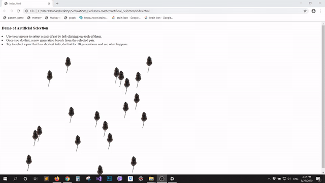

# Simulations of Evolution
Educational demos of simple simulated environments showcasing the effect of natural selection.

To run each demo, open *index.html* file in your favorite browser and read the instructions.

**Demos are:**
1. Artifical Selection
2. Bacterial Resistance
3. Speciation
4. Species Diversification
5. XO_Game_Learning using Genetic Algorthim (Please note that **Predictive Hebbian Unified Neurons** or **PHUN** is currently a better method for this purpose. For more info on PHUN go to: https://www.brainxyz.com/

These demos are for educational purposes and have been featured in an eductional YouTube series on the subject of Evolution presented in Kurdish language (Link: https://youtu.be/ZNIql2aZFdQ?list=PL_i1-c5qeAEo0FmqxBIVAnATC9Mt6rnfH )

--------------------------------------------------------

**Artificial Selection - Simulated Demo**

The demo shows the end result of mating between shorter tailed rats. After selecting a pair of short tailed rats, a new generation breeds from the selected rats
play here: https://hunar4321.github.io/Simulations_Evolution/Artificial_Selection/index.html

 

**Simulated Environment - Survival of The Fittest**

 

Used Libraries for graphics: P5.js and Enchant.js
